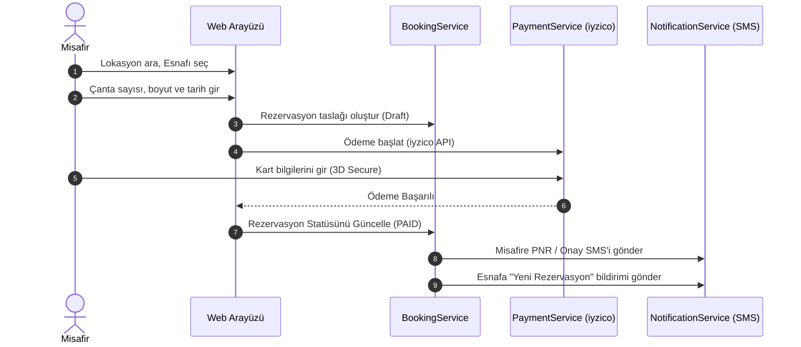
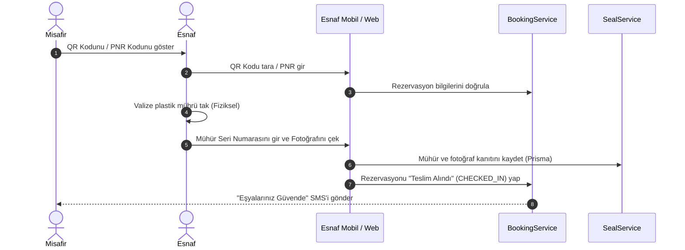
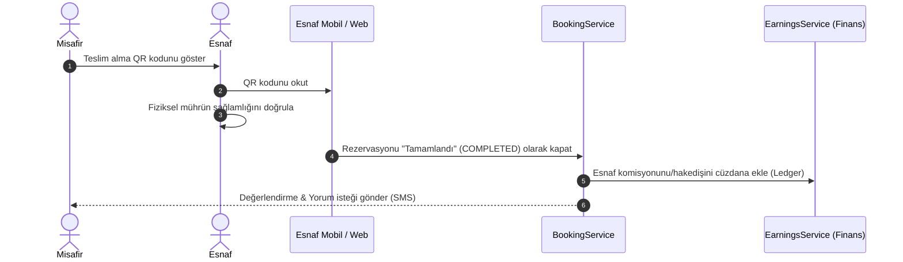

# Emanetçi (BagajPark) Uygulama Akışları ve Kullanım Senaryoları (Use Cases) Kılavuzu

Bu doküman, Emanetçi (BagajPark) platformunun teknik ve operasyonel iş akışlarını, veritabanı durum geçişlerini ve sistemin sunduğu tüm rol bazlı Kullanım Senaryolarını (Use Cases) detaylandırmak amacıyla hazırlanmıştır.

---

## BÖLÜM 1: Temel Operasyonel ve Teknik Akışlar

Uygulamanın çalışması, üç ana aşamadan oluşan bir durum makinesi (State Machine) olarak tasarlanmıştır: **Rezervasyon → Check-In → Check-Out**.

### 1. Rezervasyon ve Ödeme Akışı (Booking & Payment Flow)
Kullanıcının haritadan esnafı bulup rezervasyonunu tamamlaması sürecidir.

*   **Veritabanı Durumu:** `BookingStatus: DRAFT` ➡️ `BookingStatus: PAID`
*   **İlgili Servisler:** [BookingService](file:///Users/furkan/emanetcim/src/services/BookingService.ts), [PaymentService](file:///Users/furkan/emanetcim/src/services/PaymentService.ts), [NotificationService](file:///Users/furkan/emanetcim/src/services/NotificationService.ts)

---

### 2. Check-In Akışı (Valiz Teslim Etme ve Mühürleme)
Misafirin dükkana ulaşıp eşyalarını güvenli bir şekilde esnafa teslim etme sürecidir.

*   **Veritabanı Durumu:** `BookingStatus: PAID` ➡️ `BookingStatus: CHECKED_IN`
*   **Mühür Kaydı:** `Seal` tablosunda rezervasyon id, mühür numarası ve `photoUrl` ilişkisi kurulur.
*   **İlgili Servisler:** [SealService](file:///Users/furkan/emanetcim/src/services/SealService.ts), [BookingService](file:///Users/furkan/emanetcim/src/services/BookingService.ts)

---

### 3. Check-Out Akışı (Valiz Teslim Alma)
Misafirin seyahat/ziyaret sonrasında dükkana geri dönüp eşyalarını teslim alması ve sürecin kapanmasıdır.

*   **Veritabanı Durumu:** `BookingStatus: CHECKED_IN` ➡️ `BookingStatus: COMPLETED`
*   **Finansal Etki:** `Ledger` veya `PartnerWallet` tablosunda hakediş kaydı oluşturulur.
*   **İlgili Servisler:** [BookingService](file:///Users/furkan/emanetcim/src/services/BookingService.ts), [ReviewService](file:///Users/furkan/emanetcim/src/services/ReviewService.ts)

---

## BÖLÜM 2: Rol Bazlı Kullanım Senaryoları (Use Cases)

### 🎒 1. Misafir (Gezgin) Senaryoları

#### UC_M_01: Lokasyon Bazlı Mağaza Arama
*   **Açıklama:** Misafir harita üzerinden filtreleme yaparak en yakın veya en ucuz emanetçileri listeler.
*   **Giriş:** Arama çubuğuna yazılan şehir (İstanbul, Ankara vb.) veya GPS koordinatları.
*   **İş Kuralları:** Aktif olmayan, kapasitesi dolu olan veya kapalı saatlerdeki esnaflar haritada gösterilmez.

#### UC_M_02: Rezervasyon ve iyzico ile Ödeme
*   **Açıklama:** Misafir tarih aralığı, çanta sayısı ve boyutlarını (S/M/L/XL) seçerek ödemesini tamamlar.
*   **İş Kuralları:** `PricingService` üzerinden fiyat hesaplanır. Ödemeler iyzico 3D Secure aracılığıyla gerçekleşir. Rezervasyon tamamlandığında PNR ve dinamik bir JWT QR kodu üretilir.

#### UC_M_03: İptal ve Kesintisiz İade
*   **Açıklama:** Misafir planda değişiklik olduğunda rezervasyonunu iptal eder.
*   **İş Kuralları:** Teslimat saatine 1 saat kalana kadar yapılan iptallerde `PaymentService` iyzico API'si üzerinden %100 kesintisiz para iadesini tetikler.

#### UC_M_04: Esnaf Değerlendirme & Puanlama
*   **Açıklama:** Misafir valizini aldıktan sonra deneyimini puanlar (1-5 yıldız) ve yorum yazar.
*   **İş Kuralları:** Yorumlar hemen yayınlanmaz. Admin panel onayı sonrasında ilgili dükkan profilinde listelenir.

---

### 🏪 2. Esnaf (İş Ortağı) Senaryoları

#### UC_E_01: Mobil Oturum Açma ve Kimlik Doğrulama
*   **Açıklama:** Esnaf mobil panelden işlemlerini yönetmek için giriş yapar.
*   **Teknik Detay:** `getMobileSession` fonksiyonu kullanılır. Sistemde `isBanned` kontrolleri 30 saniyelik önbellek (in-process cache) ile sorgulanır. Askıya alınan kullanıcıların istekleri anında reddedilir.

#### UC_E_02: Kapasite ve Uygunluk Yönetimi
*   **Açıklama:** Esnaf dükkanının günlük valiz kabul kapasitesini değiştirir veya geçici olarak dükkanı aramaya kapatır (Tatil modu).
*   **İş Kuralları:** Kapasite değişikliği, mevcut onaylanmış aktif rezervasyonları etkilemez; yeni rezervasyonları engeller.

#### UC_E_03: Fotoğraflı ve Mühürlü Check-In
*   **Açıklama:** Esnaf gelen misafirin valizine fiziksel mühür takar ve sisteme kanıt yükler.
*   **İş Kuralları:** Mühür seri numarası ve valizin mühürlü halinin fotoğrafının yüklenmesi zorunludur. `SealService` aracılığıyla veritabanına kaydedilir.

#### UC_E_04: Check-Out ile Teslimat Kapatma
*   **Açıklama:** Misafir geldiğinde esnaf QR kodunu okutup mühür kontrolünü yaparak valizi teslim eder.
*   **İş Kuralları:** QR doğrulandıktan sonra rezervasyon statüsü `COMPLETED` olur ve esnaf bakiyesine hakediş tutarı otomatik işlenir.

#### UC_E_05: Finansal Raporlama ve Kazanç Takibi
*   **Açıklama:** Esnaf günlük, haftalık ve aylık bazda toplam kazancını panelden takip eder.
*   **İş Kuralları:** `todayEarnings` istatistikleri, tarih aralığı filtresi kullanılarak geçmiş veri kümesinden dinamik olarak hesaplanır.

---

### 🛡️ 3. Yönetici (Admin) Senaryoları

#### UC_A_01: Esnaf Başvuru Onayı
*   **Açıklama:** Sisteme yeni kaydolmak isteyen esnafların vergi levhası, kimlik ve dükkan fotoğrafları doğrulanarak sisteme kabul edilir.
*   **İş Kuralları:** Onay sonrasında esnafa başlangıç mühür kiti kargolanır.

#### UC_A_02: Kural Ayarları (PlatformSettings)
*   **Açıklama:** Admin, platform genelindeki maksimum kalış süresini, komisyon oranlarını ve sigorta bedellerini değiştirir.
*   **İş Kuralları:** Değişiklikler yapıldıktan sonraki yeni rezervasyonlar için geçerli olur, geçmiş rezervasyonları etkilemez.

#### UC_A_03: Uyuşmazlık (Dispute) Yönetimi
*   **Açıklama:** Valizin kaybolması, zarar görmesi durumunda admin süreci inceler.
*   **İş Kuralları:** `SealService` tarafından kaydedilen teslim anı fotoğrafı ile mevcut durum karşılaştırılır. Kusur durumuna göre sigorta süreci işletilir.

---

## BÖLÜM 3: Teknik Modüller ve Sorumluluk Dağılımı

Uygulamanın çekirdek iş mantığı `src/services/` altındaki şu servisler tarafından yürütülmektedir:

1.  **[BookingService](file:///Users/furkan/emanetcim/src/services/BookingService.ts):** Rezervasyon oluşturma, durum güncelleme, iptal kontrolü ve listeleme işlemlerini yürütür.
2.  **[PaymentService](file:///Users/furkan/emanetcim/src/services/PaymentService.ts):** iyzico ödeme geçidi entegrasyonu, iade (refund) çağrıları ve komisyon dağıtım modellerini yönetir.
3.  **[SealService](file:///Users/furkan/emanetcim/src/services/SealService.ts):** Fiziksel güvenlik mühürlerinin atanması, fotoğraf yükleme işlemleri ve güvenlik doğrulamalarını üstlenir.
4.  **[NotificationService](file:///Users/furkan/emanetcim/src/services/NotificationService.ts):** Netgsm entegrasyonu ile SMS gönderimi, OTP doğrulama kodları ve durum değişiklik bildirimlerini koordine eder.
5.  **[PricingService](file:///Users/furkan/emanetcim/src/services/PricingService.ts):** Valiz boyutu, gün sayısı ve platform ayarlarına göre dinamik sepet tutarını hesaplar.
6.  **[ShopService](file:///Users/furkan/emanetcim/src/services/ShopService.ts):** Esnaf dükkanlarının koordinat aramaları, harita pin listelemeleri ve kapasite güncellemelerini yönetir.
